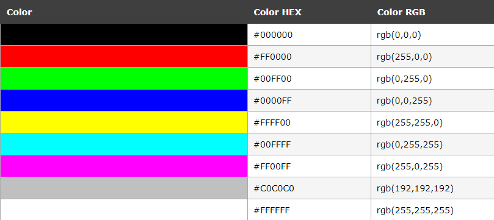
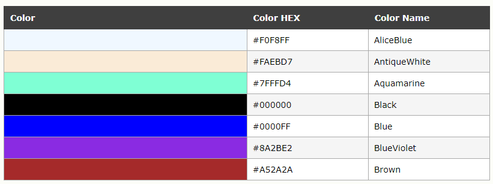
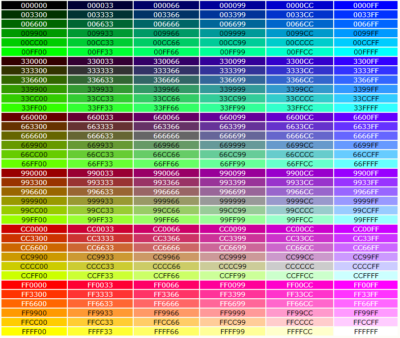

  
  
- [颜色](#颜色 )
  - [颜色值](#颜色值 )
  - [颜色名](#颜色名 )
  - [Web 安全色](#web-安全色 )
  
[返回目录](Readme.md )
  
###  颜色
  
  
####  颜色值
  
颜色由一个十六进制的数字来定义，代表 RGB 值
  
最小值是 0，即 #00
最大值是 255，即 #FF
  

  
####  颜色名
  
  
因为用数字表示颜色难以记忆，所以一部分常用颜色被命名，但其他颜色仍然要用十六进制数表示
  

  
[完整的颜色名表](https://www.w3school.com.cn/html/html_colornames.asp )
  
####  Web 安全色
  
因为微软和 Mac 操作系统使用了不同的保留固定系统颜色，所以额外规定了 216 种安全色可以跨平台使用
  

  
